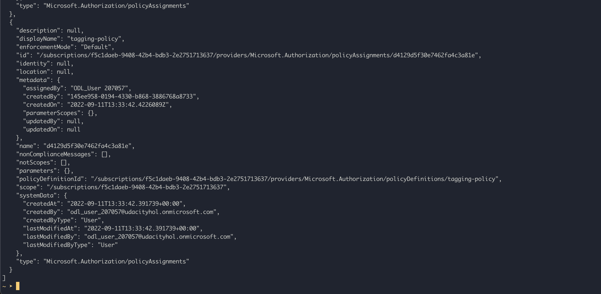

# Azure Infrastructure Operations Project: Deploying a scalable IaaS web server in Azure

### Introduction
For this project, you will write a Packer template and a Terraform template to deploy a customizable, scalable web server in Azure.

### Getting Started
1. Clone this repository

2. Change the directory to `C1 - Azure Infrastructure Operations/project/starter_files/`

3. Make sure you have an Azure account, install Azure CLI, Packer and Terraform.

### Dependencies
1. Create an [Azure Account](https://portal.azure.com)
2. Install the [Azure command line interface](https://docs.microsoft.com/en-us/cli/azure/install-azure-cli?view=azure-cli-latest)
3. Install [Packer](https://www.packer.io/downloads)
4. Install [Terraform](https://www.terraform.io/downloads.html)

### Instructions

#### Build Packer image

First you will need to authenticate with Azure by using Azure Service Principle by running this command:

```bash
export ARM_CLIENT_ID=<your-client-id>
export ARM_CLIENT_SECRET=<your-client-secrets>
export ARM_SUBSCRIPTION_ID=<your-sb-subscription-id>
```

Next, try to build the packer image by using the `server.json` file within this directory:

```bash
packer build server.json
```

Once the packer image is built, take notes on the returned packer image ID since you will need it to provision resources.

#### Provision resources

Once the packer images is built, we can start to provision resources to Azure.

Since Terraform will require tenant ID for your Azure account, you will need to export the tenant ID as well:

```bash
export ARM_TENANT_ID=<your-tenant-id>
```

After the export, you can start provisioning your resources by running these commands

- Change the directory to terraform directory

```bash
cd terraform/
```

- Apply the terraform template by running:

```bash
terraform apply -var="common_tags={"your": "tags", "are": "here"}" -var="image_id=<your packer image id>" -vars="number_of_vm=<number of desired VMs>"
```

- Alternatively, you can modify the default values in `vars.tf` file and use with your terraform templates.

### Output

After the deployment, you can login to the Azure Portal and see the corresponding resource are deployed without any error

Along the deployment, there was an Azure policy deployed to make sure that all resource must have tags to make it easier to manage:



Please note that all of the contents being written in here are based on HarshiCorp documentation pages:

- https://registry.terraform.io/providers/hashicorp/azurerm/latest/docs
- https://www.packer.io/docs/templates